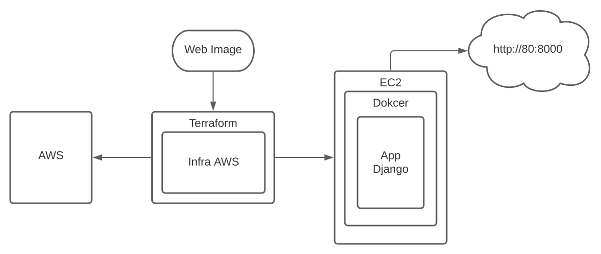

# Desafio infra como código Pagar.me

## Requisitos 
- Terraform v1.0.7
- AWS CLI
- Conta na AWS

## Sobre o Desafio
Neste projeto temos uma infraestrutura em nuvem hospedada na AWS, contruída através do terraform. Na nuvem contém uma aplicação bem simples feita em django, na qual utiliza containers docker para ser executada.

## Iniciando sua Infraestrutura
Configure o AWS CLI em sua máquina. Antes de qualquer coisa acesse o diretório **desafio-pagar.me/terraform**, em seguida, execute o comando a baixo e siga as instruções
~~~shell
$ aws configure
~~~
~~~shell
AWS Access Key ID : 
AWS Secret Access Key : 
Default region name : 
Default output format :
~~~
> Observação: Verifique se a região que a sua conta na AWS está configurada é a mesma que está configurada no Terraform, pois pode haver conflito e ao aplicar, você terá um erro.

